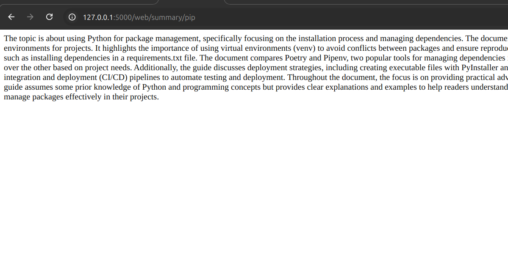

Personal Experiment with Local LLM using ollama: Perplexity Clone

This project aims to create an experiment with a local LLM-based agent to extract relevant information on a given topic. Initially, the idea was to use an agent to autonomously extract content, but using Llama 3.1 locally with Ollama didn’t work as expected. Instead,
I relied on prompting to achieve a similar effect.

Functionality

Currently, when a user submits a GET request via the web-summary endpoint:

    A DuckDuckGo search is performed to find the top 10 search results (configurable).
    From the top 10 results, 3 results are selected (also configurable).
    HTML body contents are pulled from those URLs.
    Then the extracted body contents are injected into a Jinja prompt to generate the finalized summary.

Requirements

To run the application, follow these steps:

    Install the necessary dependencies using pip (see requirements.txt).
    Run the Flask application.

The current version (v1.0) relies on making local calls to Llama 3.1, which must be running locally. For more information
refer https://github.com/ollama/ollama. 

Notes

    This project is still in the experimental phase and is not the final implementation.
    There is significant room for code improvements and the potential to extend functionality.

Future Improvements

    More advanced summarization techniques and error handling.
    Better handling of Llama 3.1's limitations and performance optimization.
    Benchmarking and Unit Testing. Code refactoring.

Sample Request and Response: 

